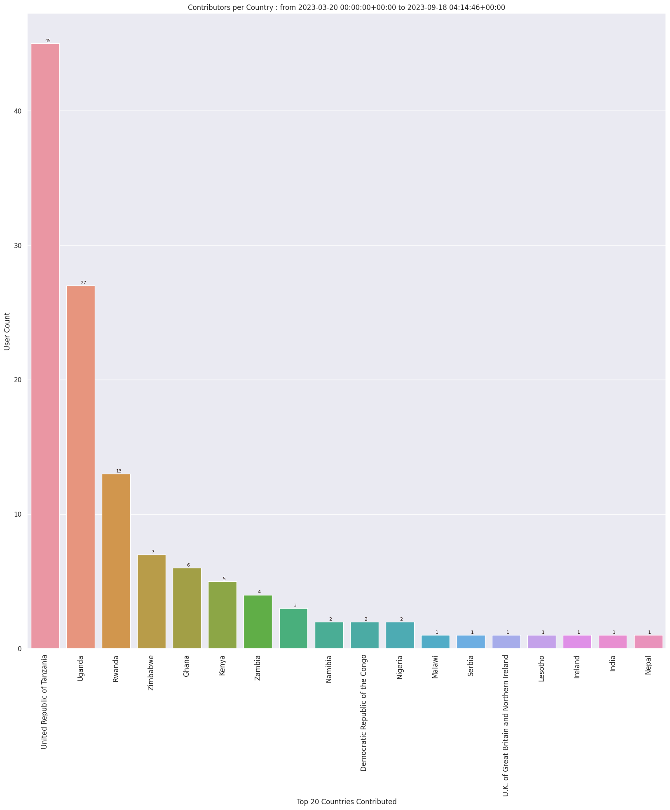

### Last Update : Stats from 2023-03-20 00:00:00+00:00 to 2023-05-12 04:07:24+00:00 (UTC Timezone)

#### 57 Users made 3.5 thousand changesets with 47.5 thousand map changes.
#### 17.5 thousand OSM Elements were Created, 29.9 thousand Modified & 92 Deleted.
Get Full Stats at [stats.csv](/stats/mapherworld/Daily/stats.csv)
 & Get Summary Stats at [stats_summary.csv](/stats/mapherworld/Daily/stats_summary.csv)

Top 5 Users are : 
- paulsangu14 : 9.1 thousand Map Changes
- charles chilufya : 9.0 thousand Map Changes
- Yves umuganwa : 3.5 thousand Map Changes
- DvnMartinez : 3.1 thousand Map Changes
- Kelvin Manase : 2.9 thousand Map Changes

Summary of Supplied Tags
- poi = Created: 10.1 thousand, Modified : 12.7 thousand
- building = Created: 7.4 thousand, Modified : 15.4 thousand
- highway = Created: 1.5 thousand, Modified : 83
- waterway = Created: 10, Modified : 1
- amenity = Created: 991, Modified : 8.1 thousand
- highway length created = 4 Km

Top 5 Created tags are :
- building: 7.4 thousand
- roof:shape: 6.0 thousand
- addr:housenumber: 1.9 thousand
- name: 1.6 thousand
- building:levels: 1.6 thousand

Top 5 Modified tags are :
- building: 15.4 thousand
- check_date: 14.7 thousand
- name: 12.7 thousand
- roof:shape: 11.1 thousand
- building:levels: 10.2 thousand

Top 5 trending hashtags are:
- #MapHerWorld : 43 users
- #OSMRwanda : 9 users
- #mapherworld : 9 users
- #MapRwanda : 7 users
- #EveryDoorRwanda : 7 users

Top 5 trending Countries where user contributed are:
- United Republic of Tanzania : 22 users
- Rwanda : 10 users
- Zimbabwe : 7 users
- Ghana : 5 users
- Kenya : 4 users

 Charts : 
 
 
 
 
