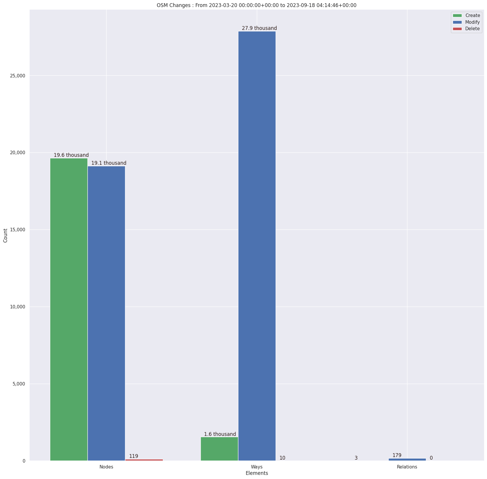

### Last Update : Stats from 2023-03-20 00:00:00+00:00 to 2023-04-21 04:07:30+00:00 (UTC Timezone)

#### 30 Users made 1.2 thousand changesets with 13.4 thousand map changes.
#### 4.0 thousand OSM Elements were Created, 9.4 thousand Modified & 25 Deleted.
Get Full Stats at [stats.csv](/stats/mapherworld/Daily/stats.csv)
 & Get Summary Stats at [stats_summary.csv](/stats/mapherworld/Daily/stats_summary.csv)

Top 5 Users are : 
- paulsangu14 : 3.6 thousand Map Changes
- Paxxy : 2.4 thousand Map Changes
- charles chilufya : 2.1 thousand Map Changes
- Kelvin Manase : 1.5 thousand Map Changes
- asmakulaga : 780 Map Changes

Summary of Supplied Tags
- poi = Created: 742, Modified : 5.4 thousand
- building = Created: 621, Modified : 3.4 thousand
- highway = Created: 36, Modified : 23
- waterway = Created: 1, Modified : 0
- amenity = Created: 365, Modified : 3.4 thousand
- highway length created = 0 Km

Top 5 Created tags are :
- building: 621
- name: 494
- check_date: 486
- amenity: 365
- wheelchair: 189

Top 5 Modified tags are :
- check_date: 6.4 thousand
- name: 5.5 thousand
- amenity: 3.4 thousand
- building: 3.4 thousand
- addr:street: 3.3 thousand

Top 5 trending hashtags are:
- #MapHerWorld : 22 users
- #knustyouthmappers : 4 users
- #mapherworld : 4 users
- #100women : 3 users
- #youthmappers : 3 users

Top 5 trending Countries where user contributed are:
- United Republic of Tanzania : 11 users
- Ghana : 4 users
- Zambia : 3 users
- Uganda : 3 users

 Charts : 
 
 
 
 
