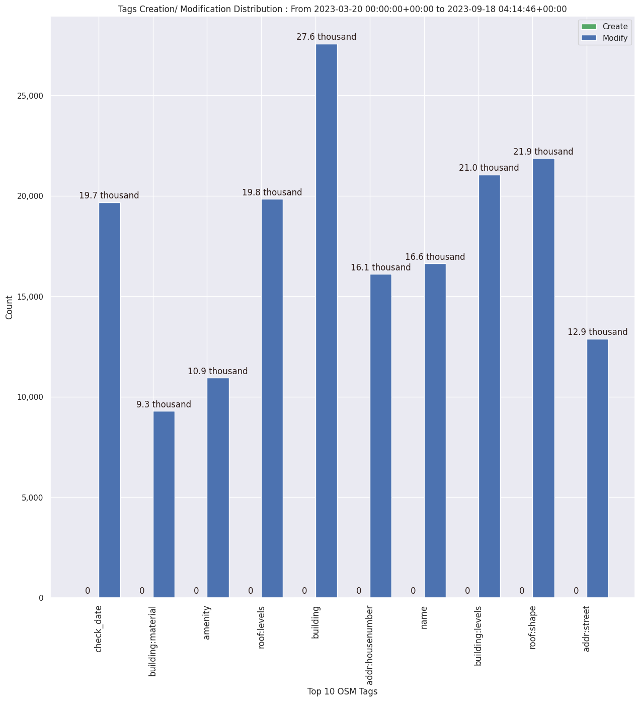

### Last Update : Stats from 2023-03-20 00:00:00+00:00 to 2023-04-04 04:06:39+00:00 (UTC Timezone)

#### 20 Users made 233 changesets with 1.2 thousand map changes.
#### 236 OSM Elements were Created, 967 Modified & 18 Deleted.
Get Full Stats at [stats.csv](/stats/mapherworld/Daily/stats.csv)
 & Get Summary Stats at [stats_summary.csv](/stats/mapherworld/Daily/stats_summary.csv)

Top 5 Users are : 
- charles chilufya : 419 Map Changes
- mildred_akoth : 345 Map Changes
- paulsangu14 : 118 Map Changes
- abdul_4ts : 86 Map Changes
- Letwin : 51 Map Changes

Summary of Supplied Tags
- poi = Created: 236, Modified : 590
- building = Created: 13, Modified : 334
- highway = Created: 5, Modified : 2
- waterway = Created: 1, Modified : 0
- amenity = Created: 112, Modified : 434
- highway length created = 0 Km

Top 5 Created tags are :
- name: 122
- check_date: 121
- amenity: 112
- natural: 62
- leaf_type: 61

Top 5 Modified tags are :
- check_date: 717
- name: 686
- amenity: 434
- wheelchair: 355
- internet_access: 335

Top 5 trending hashtags are:
- #MapHerWorld : 15 users
- #knustyouthmappers : 4 users
- #mapherworld : 3 users
- #youthmappers : 3 users
- #osmzimbabwe : 1 users

Top 5 trending Countries where user contributed are:
- United Republic of Tanzania : 8 users
- Ghana : 3 users
- Zambia : 2 users
- Kenya : 1 users
- Zimbabwe : 1 users

 Charts : 
 
 
 
 
