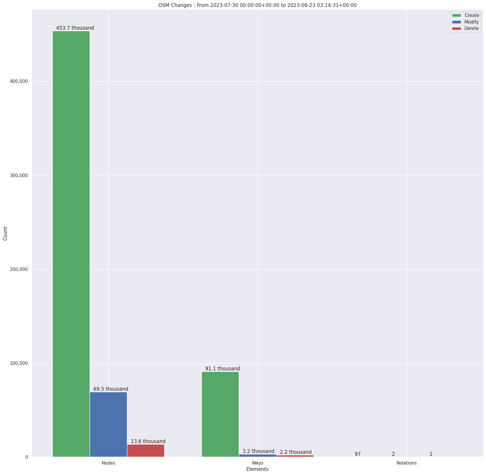
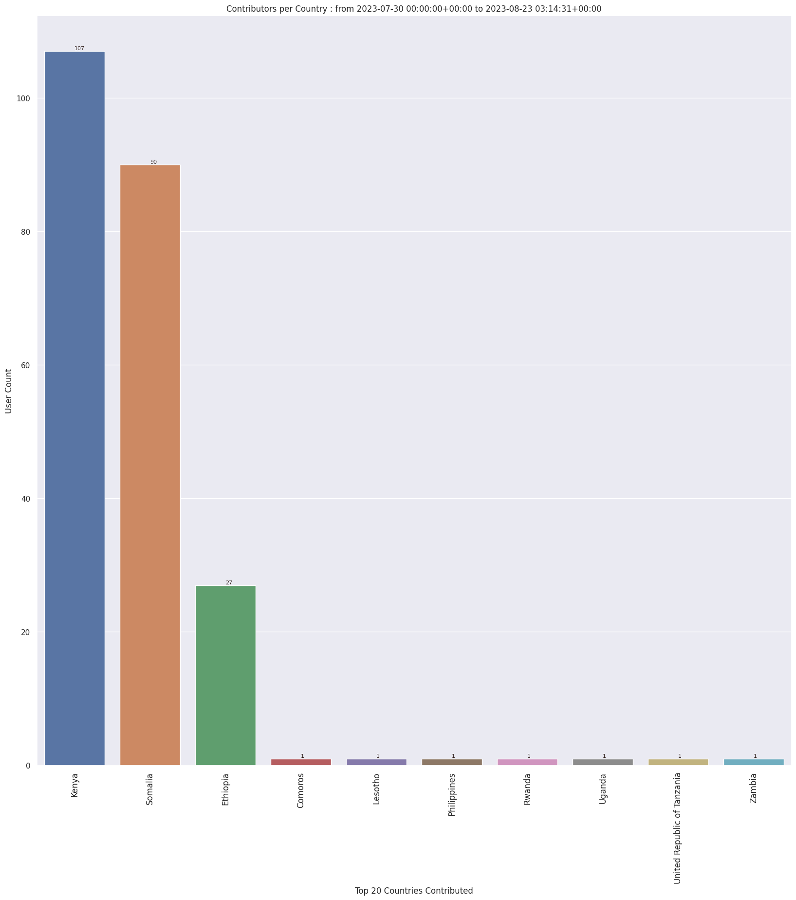
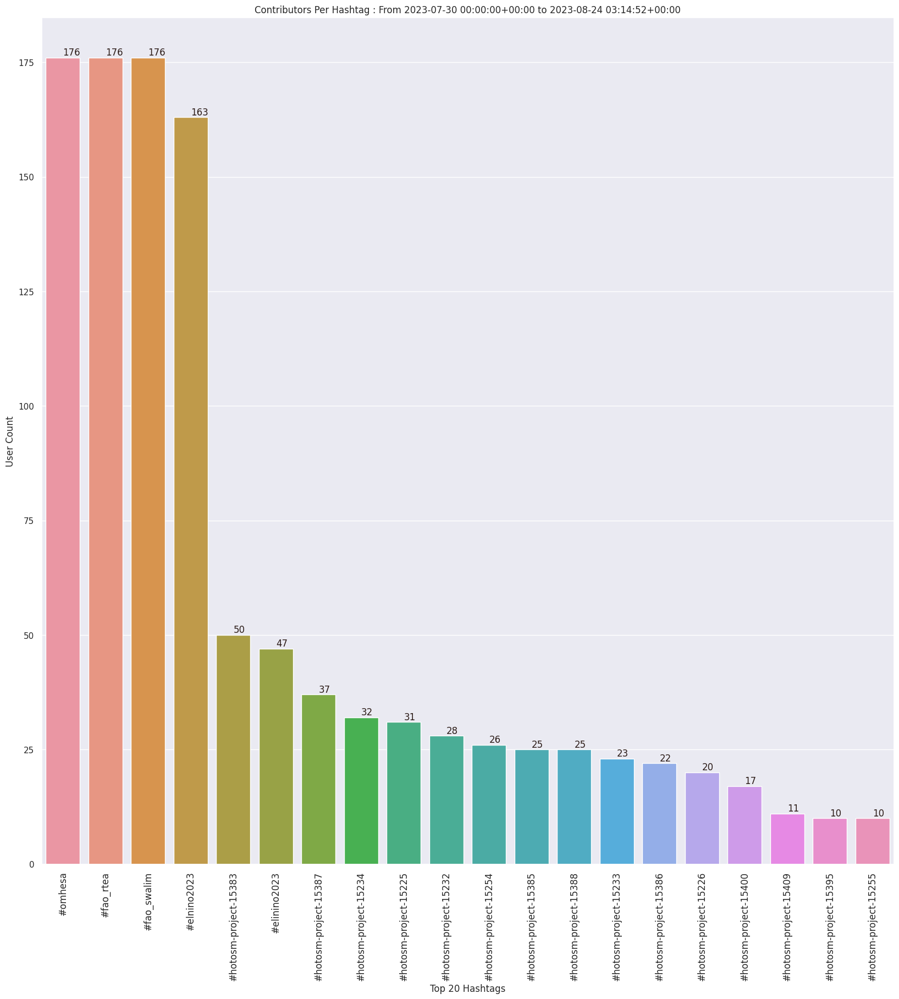
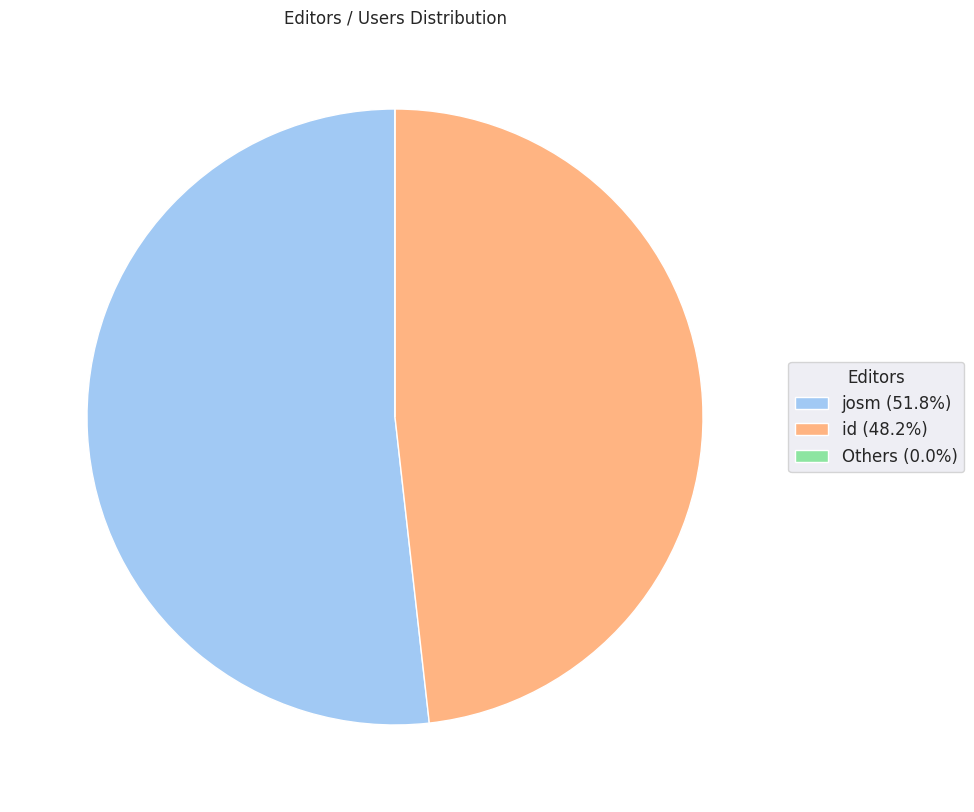
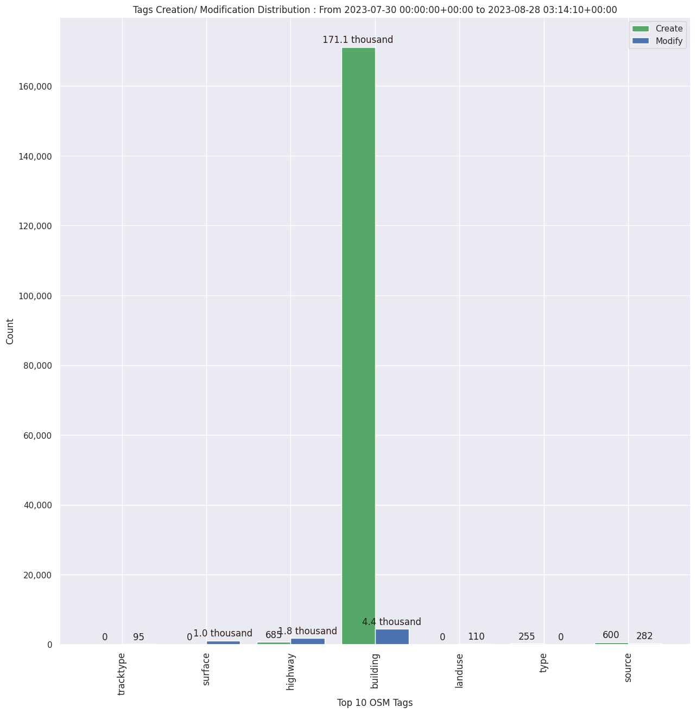

### Last Update : Stats from 2023-07-30 00:00:00+00:00 to 2023-08-31 03:13:41+00:00 (UTC Timezone)

#### 211 Users made 14.5 thousand changesets with 1.6 million map changes.
#### 1.3 million OSM Elements were Created, 218.0 thousand Modified & 41.4 thousand Deleted.
Get Full Stats at [stats.csv](/stats/omhesa/Daily/stats.csv)
 & Get Summary Stats at [stats_summary.csv](/stats/omhesa/Daily/stats_summary.csv)

Top 5 Users are : 
- Angela M Naluonde : 81.2 thousand Map Changes
- Norbert Dichter : 59.0 thousand Map Changes
- Awania Morish : 56.7 thousand Map Changes
- severino chundu : 56.6 thousand Map Changes
- Noel Samson : 54.8 thousand Map Changes

Summary of Supplied Tags
- poi = Created: 22.1 thousand, Modified : 389
- building = Created: 235.2 thousand, Modified : 6.2 thousand
- highway = Created: 947, Modified : 2.3 thousand
- waterway = Created: 22, Modified : 94
- amenity = Created: 0, Modified : 24
- highway length created = 214 Km

Top 5 Created tags are :
- building: 235.2 thousand
- highway: 947
- source: 616
- type: 280
- landuse: 135

Top 5 Modified tags are :
- building: 6.2 thousand
- highway: 2.3 thousand
- surface: 1.4 thousand
- source: 347
- landuse: 255

Top 5 trending hashtags are:
- #fao_swalim : 211 users
- #omhesa : 211 users
- #fao_rtea : 211 users
- #elnino2023 : 199 users
- #hotosm-project-15383 : 53 users

Top 5 trending editors are:
- iD 2.21.1 : 119 users
- JOSM/1.5 (18789 en) : 26 users
- JOSM/1.5 (18772 en) : 11 users
- JOSM/1.5 (18746 en) : 6 users
- JOSM/1.5 (18789 en_GB) : 6 users

Top 5 trending Countries where user contributed are:
- Kenya : 137 users
- Somalia : 132 users
- Ethiopia : 39 users
- United Republic of Tanzania : 2 users
- Philippines : 1 users

 Charts : 
 
 
 
 
 
