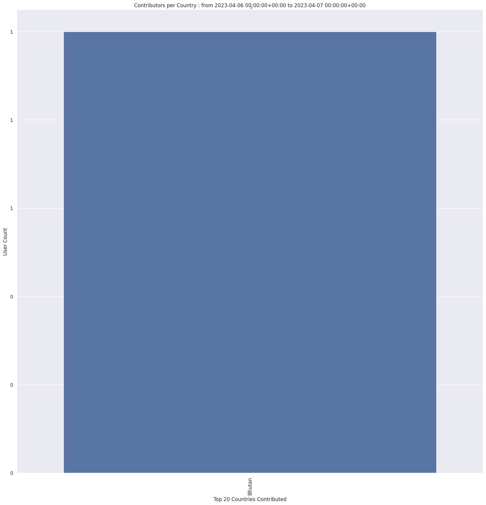
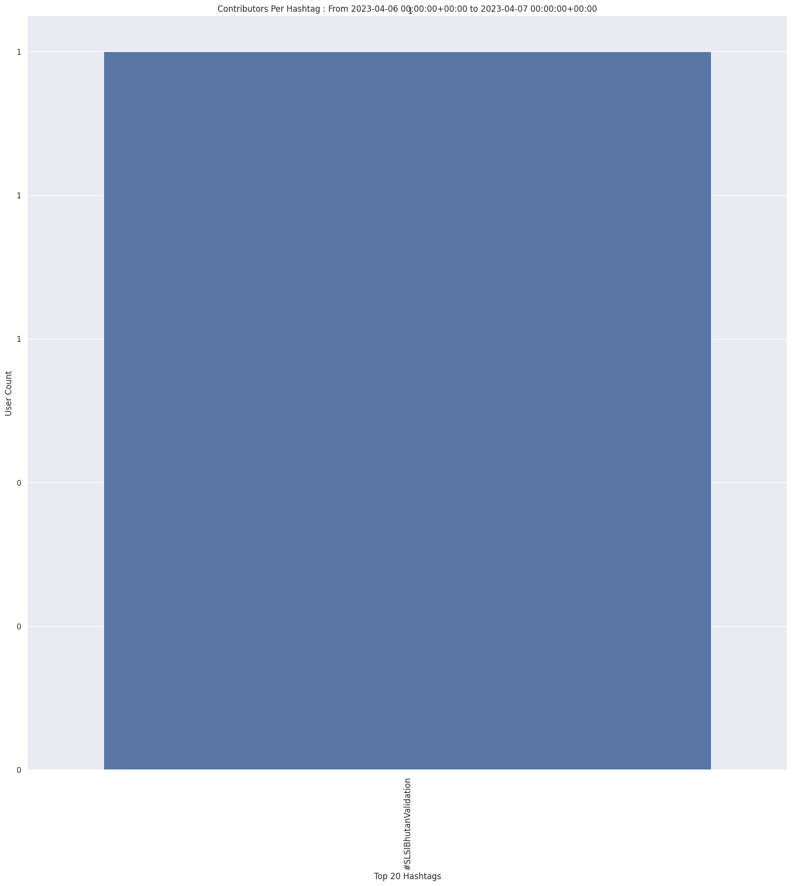
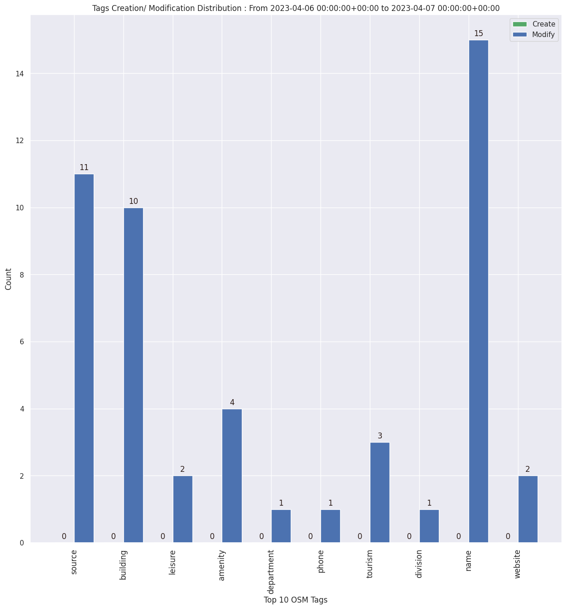

### Last Update : Stats from 2023-04-06 00:00:00+00:00 to 2023-04-07 00:00:00+00:00 (UTC Timezone)

#### 1 Users made 5 changesets with 31 map changes.
#### 0 OSM Elements were Created, 29 Modified & 2 Deleted.
Get Full Stats at [stats.csv](/stats/slsibhutan/Daily/stats.csv)
 & Get Summary Stats at [stats_summary.csv](/stats/slsibhutan/Daily/stats_summary.csv)

Top 5 Users are : 

Summary of Supplied Tags
- poi = Created: 0, Modified : 2
- building = Created: 0, Modified : 10
- highway = Created: 0, Modified : 0
- waterway = Created: 0, Modified : 0
- amenity = Created: 0, Modified : 4
- highway length created = 0 Km

Top 5 Created tags are :

Top 5 Modified tags are :
- name: 15
- source: 11
- building: 10
- amenity: 4
- tourism: 3

Top 5 trending hashtags are:
- #SLSIBhutanValidation : 1 users

Top 5 trending Countries where user contributed are:
- Bhutan : 1 users

 Charts : 
 
 
 
 
