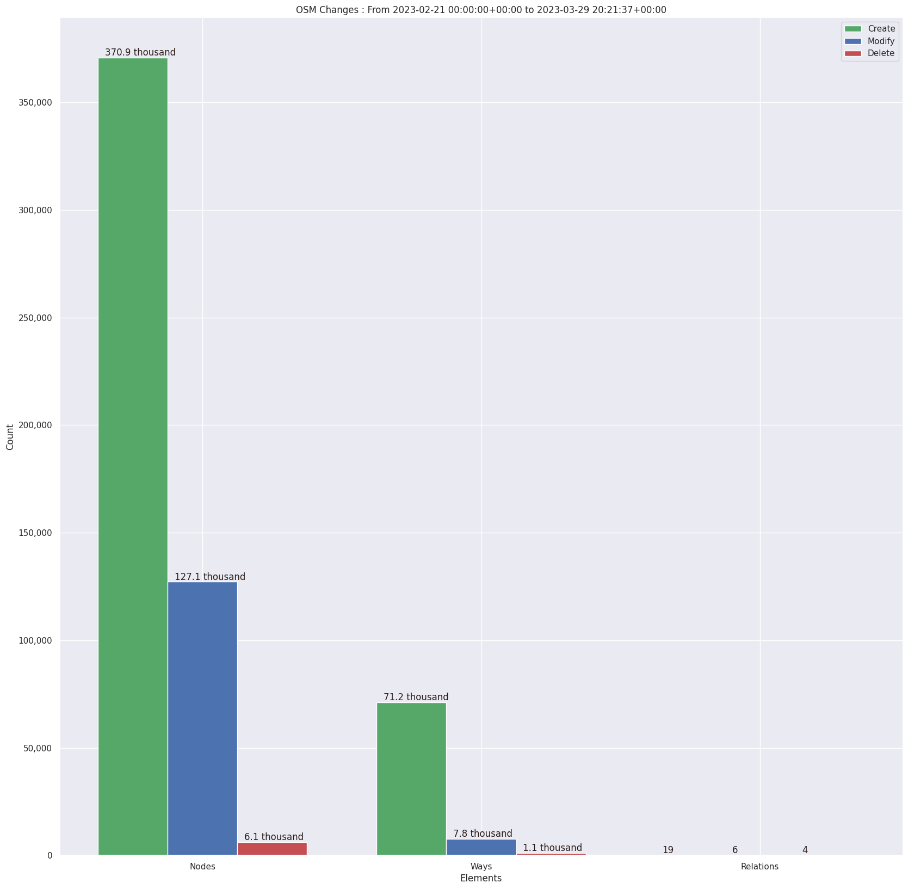
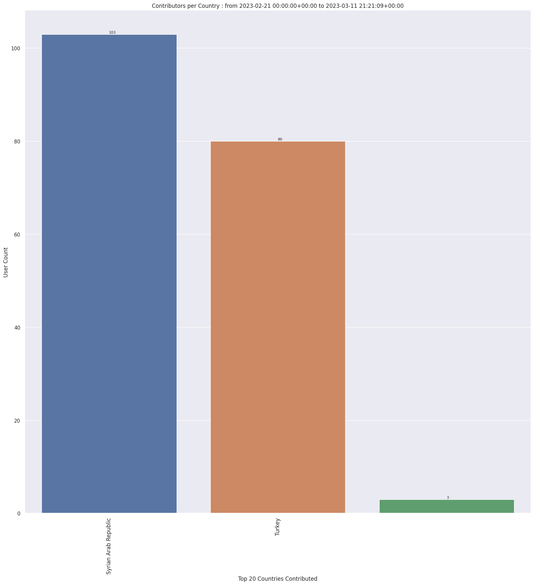
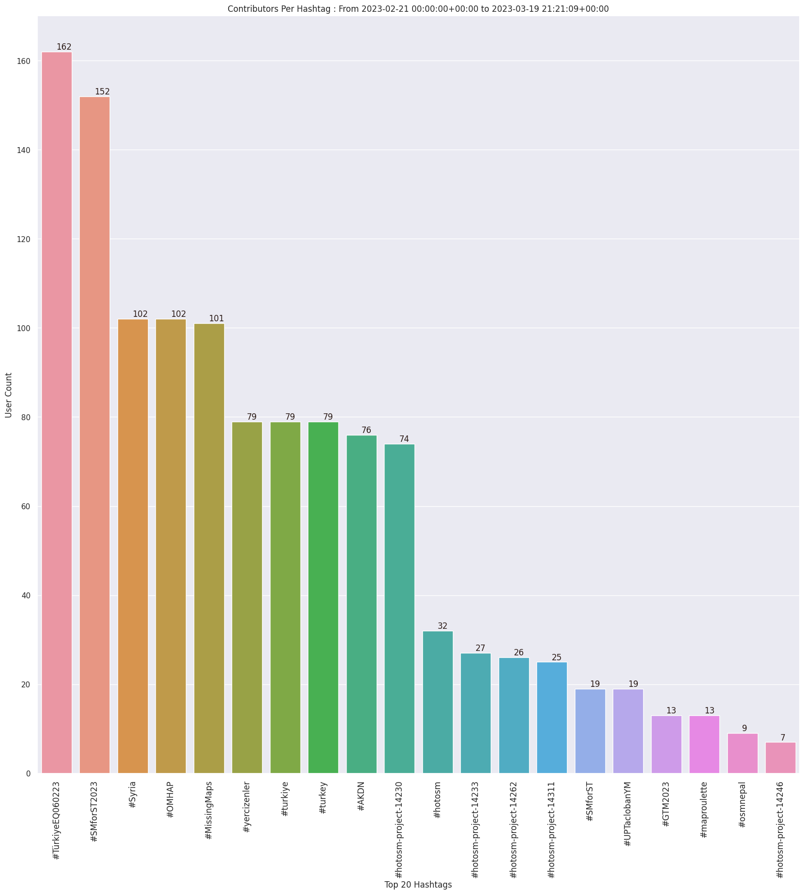
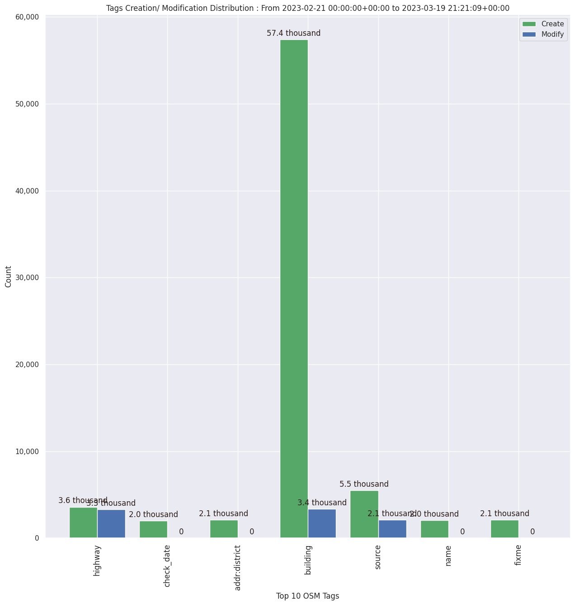

### Last Update : Stats from 2023-02-21 00:00:00+00:00 to 2023-03-18 21:21:37+00:00 (UTC Timezone)

#### 166 Users made 4.4 thousand changesets with 507.4 thousand map changes.
#### 382.1 thousand OSM Elements were Created, 122.9 thousand Modified & 2.4 thousand Deleted.
Get Full Stats at [stats.csv](/stats/smforst/Daily/stats.csv)
 & Get Summary Stats at [stats_summary.csv](/stats/smforst/Daily/stats_summary.csv)

Top 5 Users are : 
- yunita sari : 94.2 thousand Map Changes
- Manoj Thapa : 35.6 thousand Map Changes
- Rafiq Haidari : 24.8 thousand Map Changes
- Rabin Ojha : 22.9 thousand Map Changes
- Gaurav Parajuli : 19.3 thousand Map Changes

Summary of Supplied Tags
- poi = Created: 1.9 thousand, Modified : 418
- building = Created: 57.1 thousand, Modified : 3.3 thousand
- highway = Created: 3.6 thousand, Modified : 3.3 thousand
- waterway = Created: 20, Modified : 47
- amenity = Created: 1.0 thousand, Modified : 387
- highway length created = 771 Km

Top 5 Created tags are :
- building: 57.1 thousand
- source: 5.3 thousand
- highway: 3.6 thousand
- name: 1.9 thousand
- addr:district: 1.9 thousand

Top 5 Modified tags are :
- building: 3.3 thousand
- highway: 3.3 thousand
- source: 2.1 thousand
- name: 542
- amenity: 387

Top 5 trending hashtags are:
- #TürkiyeEQ060223 : 162 users
- #SMforST2023 : 152 users
- #Syria : 102 users
- #OMHAP : 102 users
- #MissingMaps : 101 users

Top 5 trending Countries where user contributed are:
- Syrian Arab Republic : 103 users
- Turkey : 85 users

 Charts : 
 
 
 
 
