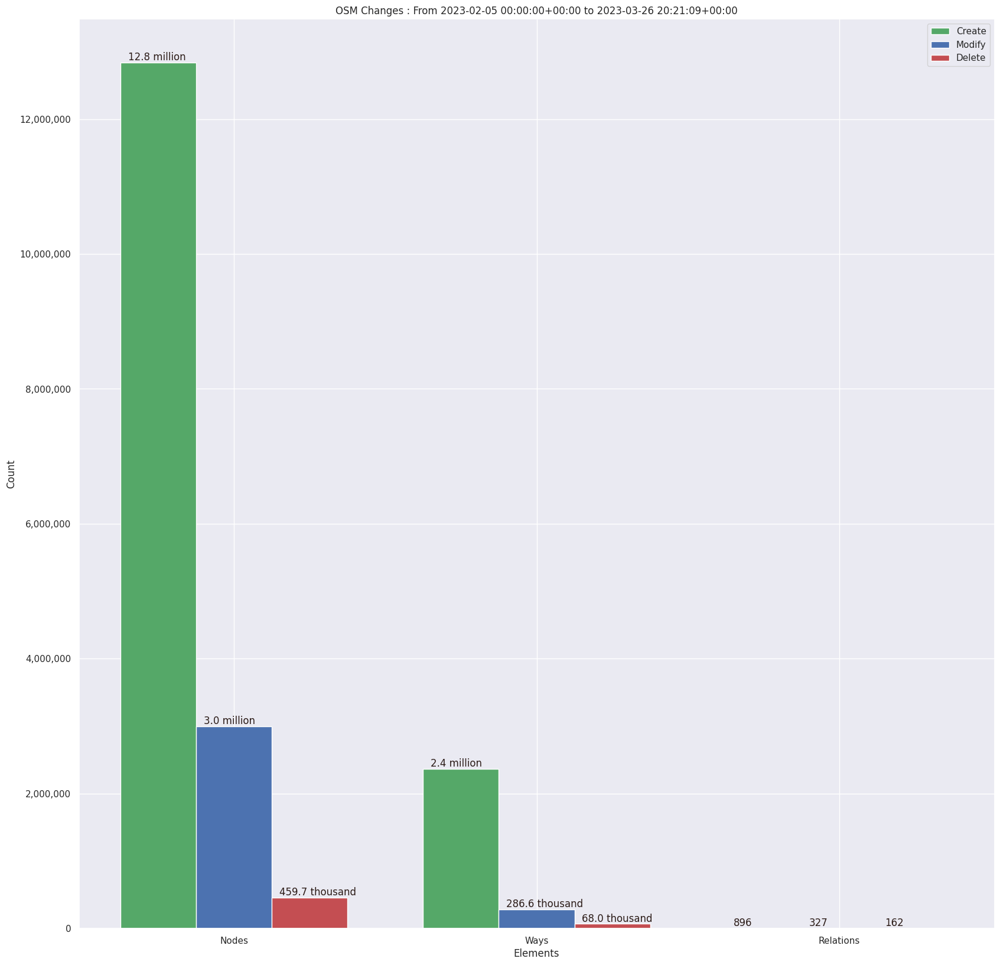
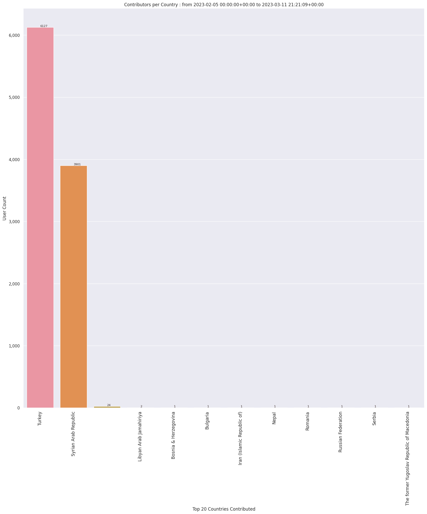
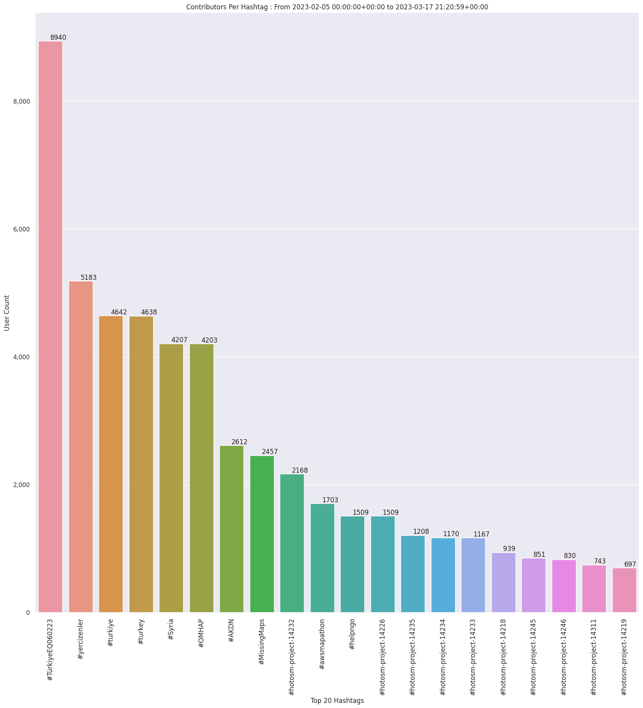
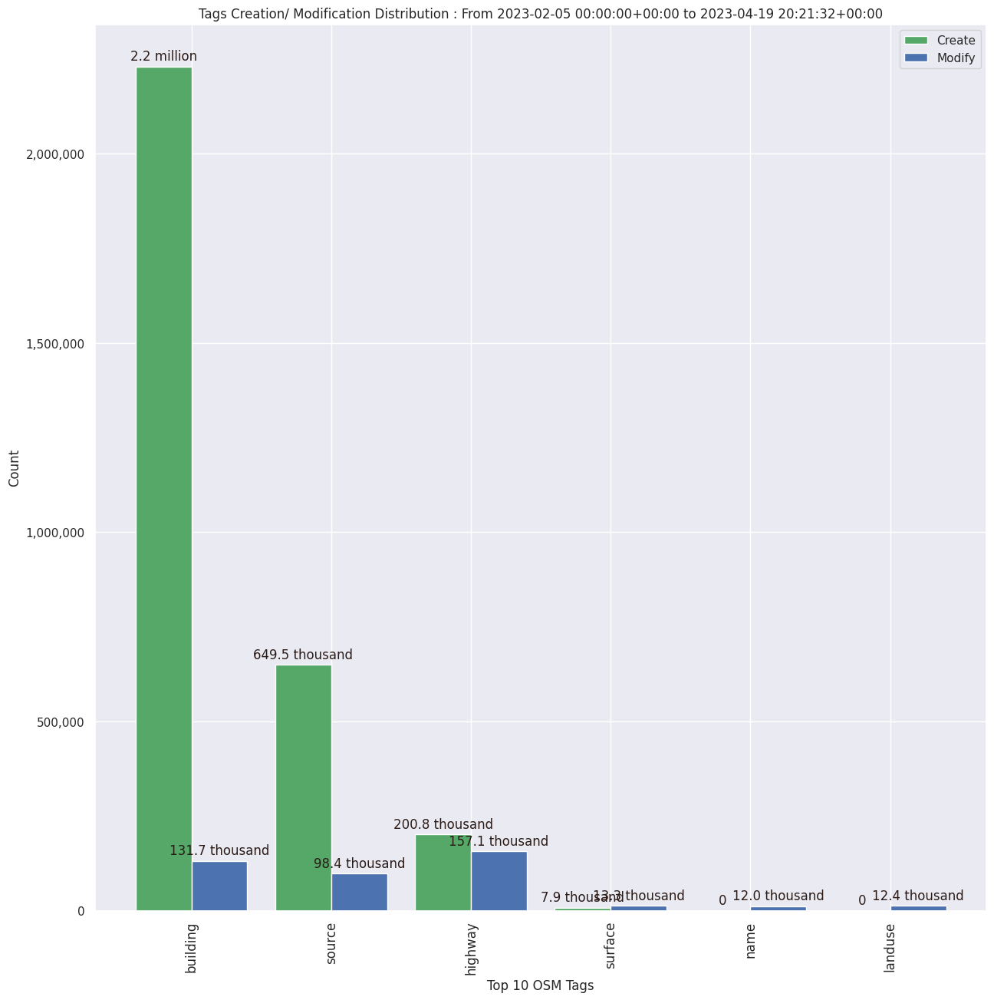

### Last Update : Stats from 2023-02-05 00:00:00+00:00 to 2023-03-28 20:21:37+00:00 (UTC Timezone)

#### 9.0 thousand Users made 136.9 thousand changesets with 19.2 million map changes.
#### 15.3 million OSM Elements were Created, 3.3 million Modified & 629.8 thousand Deleted.
Get Full Stats at [stats.csv](/stats/turkeyeq/Daily/stats.csv)
 & Get Summary Stats at [stats_summary.csv](/stats/turkeyeq/Daily/stats_summary.csv)

Top 5 Users are : 
- EsthersGeo : 267.5 thousand Map Changes
- Frans S : 204.5 thousand Map Changes
- Ky_AT : 183.9 thousand Map Changes
- Kraan46 : 170.6 thousand Map Changes
- haabee : 153.0 thousand Map Changes

Top 5 Tasking Manager Mappers are : 
- EsthersGeo : 673 Tasks Mapped
- yunita sari : 307 Tasks Mapped
- King edgar : 210 Tasks Mapped
- Marvin de Hont : 192 Tasks Mapped
- Nesim : 174 Tasks Mapped

Top 5 Tasking Manager Validators are : 
- pedr0faria : 1.6 thousand Tasks Validated
- Frans S : 1.4 thousand Tasks Validated
- Kraan46 : 1.1 thousand Tasks Validated
- SSEKITOLEKO : 834 Tasks Validated
- gnoye : 580 Tasks Validated

Summary of Supplied Tags
- poi = Created: 7.2 thousand, Modified : 5.8 thousand
- building = Created: 2.2 million, Modified : 123.4 thousand
- highway = Created: 198.2 thousand, Modified : 147.1 thousand
- waterway = Created: 1.6 thousand, Modified : 2.1 thousand
- amenity = Created: 2.6 thousand, Modified : 2.4 thousand
- highway length created = 48.2 thousand Km

Top 5 Created tags are :
- building: 2.2 million
- source: 643.3 thousand
- highway: 198.2 thousand
- surface: 7.8 thousand
- name: 7.6 thousand

Top 5 Modified tags are :
- highway: 147.1 thousand
- building: 123.4 thousand
- source: 91.8 thousand
- surface: 12.3 thousand
- landuse: 12.1 thousand

Top 5 trending hashtags are:
- #TürkiyeEQ060223 : 9022 users
- #yercizenler : 5206 users
- #turkiye : 4659 users
- #turkey : 4655 users
- #Syria : 4284 users

Top 5 trending Countries where user contributed are:
- Turkey : 6175 users
- Syrian Arab Republic : 4286 users
- Libyan Arab Jamahiriya : 2 users
- The former Yugoslav Republic of Macedonia : 1 users

 Charts : 
 
 
 
 
