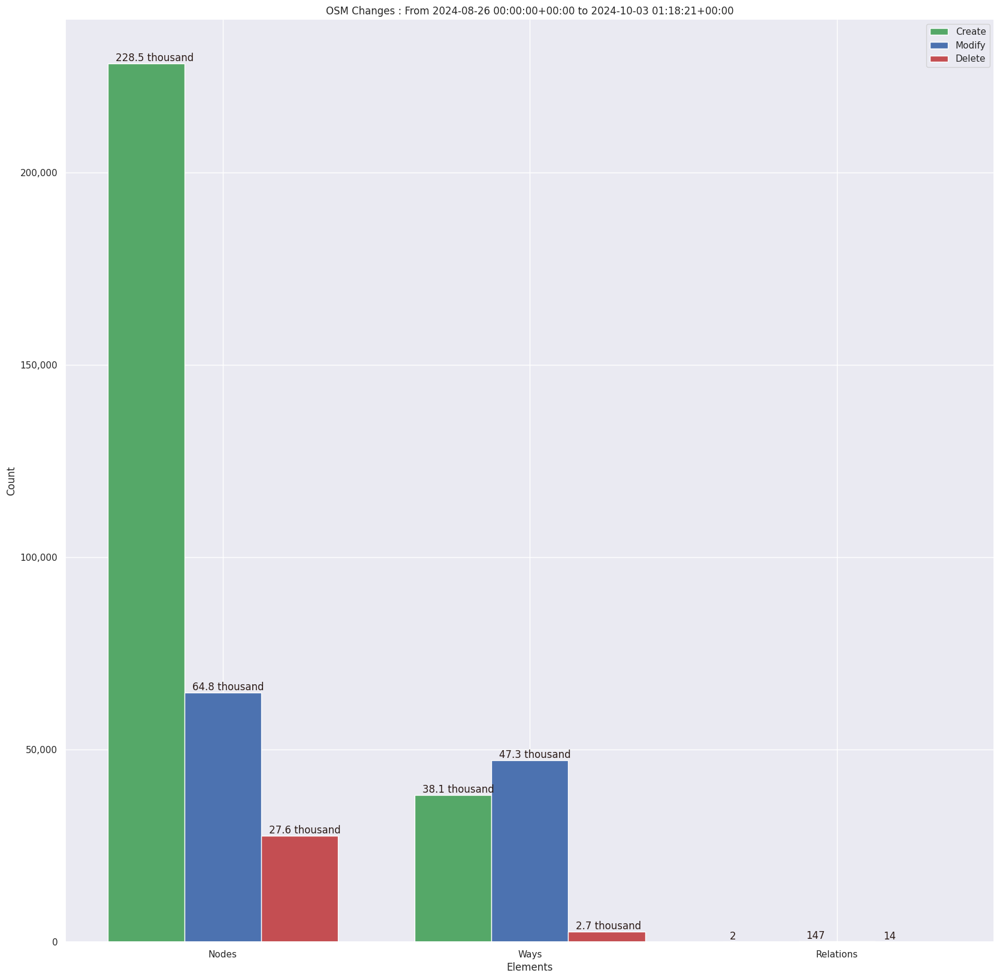
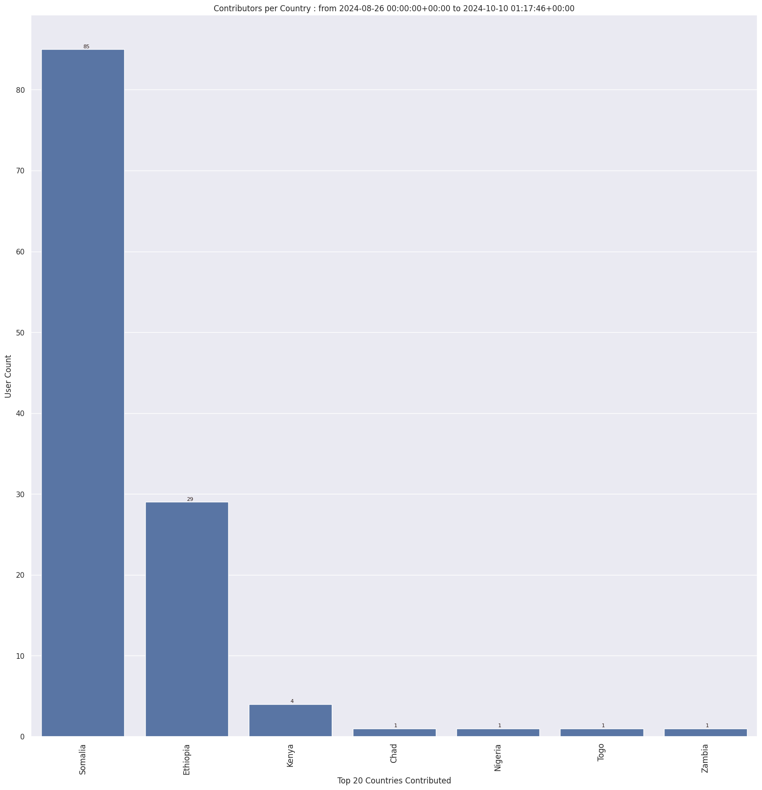
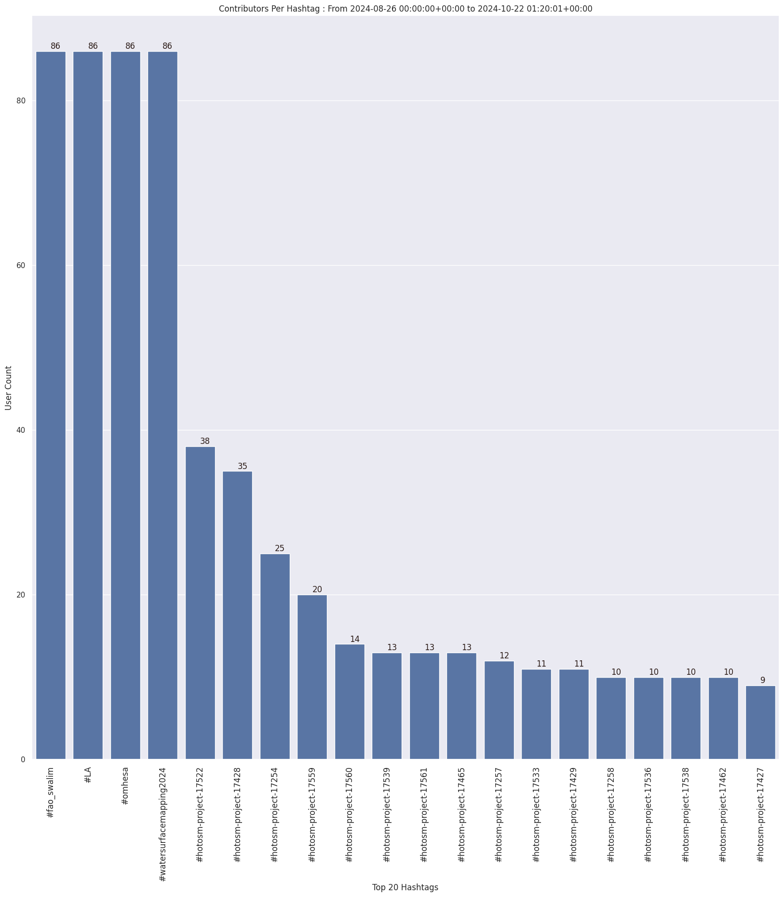
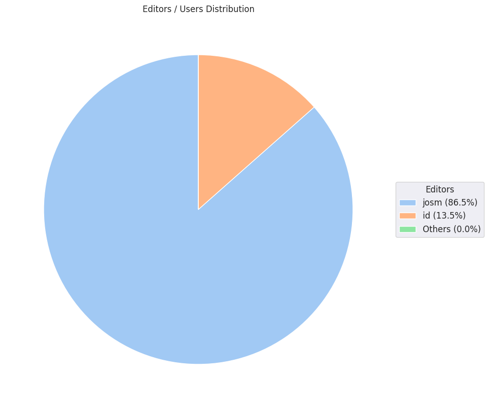
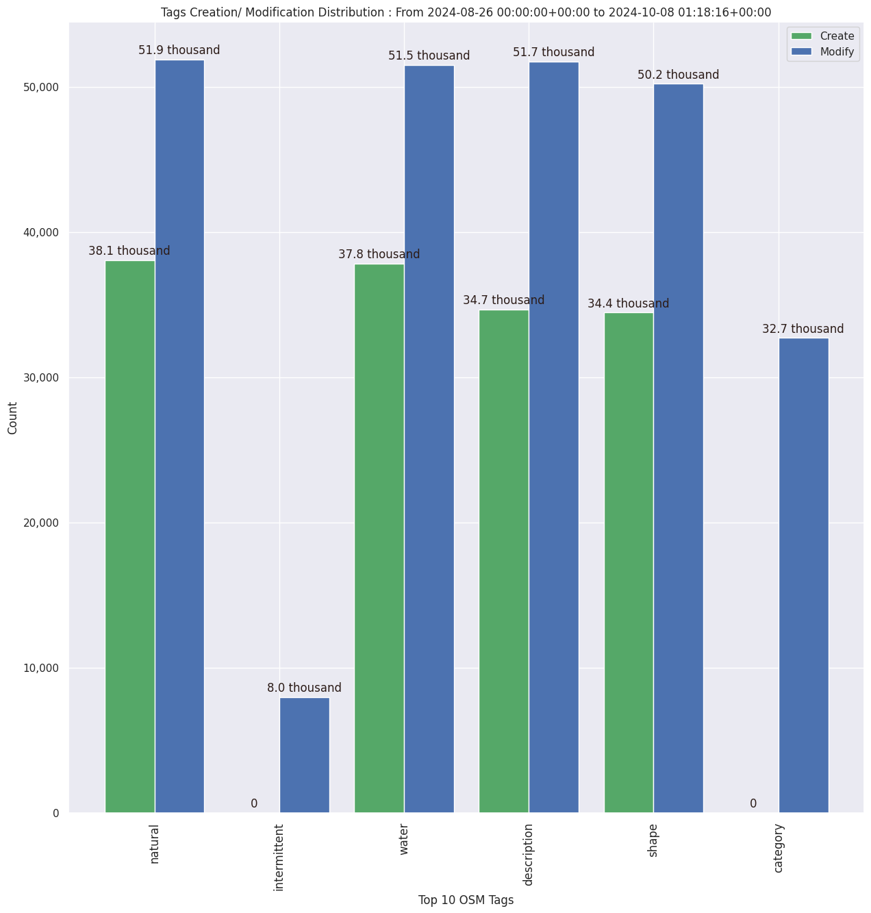

### Last Update : Stats from 2024-08-26 00:00:00+00:00 to 2024-09-05 01:14:27+00:00 (UTC Timezone)

#### 59 Users made 4.9 thousand changesets with 164.8 thousand map changes.
#### 136.2 thousand OSM Elements were Created, 15.8 thousand Modified & 12.8 thousand Deleted.
Get Full Stats at [stats.csv](/stats/watersurfacemapping/Daily/stats.csv)
 & Get Summary Stats at [stats_summary.csv](/stats/watersurfacemapping/Daily/stats_summary.csv)

Top 5 Users are : 
- KingVik : 17.0 thousand Map Changes
- severino chundu : 13.5 thousand Map Changes
- Ahmednasir_Abdi : 11.1 thousand Map Changes
- Becky Candy : 10.1 thousand Map Changes
- charles chilufya : 9.3 thousand Map Changes

Summary of Supplied Tags
- poi = Created: 165, Modified : 143
- building = Created: 122, Modified : 11
- waterway = Created: 3, Modified : 30
- amenity = Created: 0, Modified : 0
- natural = Created: 20.9 thousand, Modified : 2.4 thousand
- water = Created: 20.6 thousand, Modified : 2.4 thousand

Top 5 Created tags are :
- natural: 20.9 thousand
- water: 20.6 thousand
- description: 17.5 thousand
- shape: 17.4 thousand
- reservoir_type: 317

Top 5 Modified tags are :
- natural: 2.4 thousand
- water: 2.4 thousand
- description: 2.4 thousand
- shape: 2.2 thousand
- intermittent: 148

Top 5 trending hashtags are:
- #fao_swalim : 59 users
- #omhesa : 59 users
- #watersurfacemapping2024 : 59 users
- #LA : 59 users
- #hotosm-project-17428 : 34 users

Top 5 trending editors are:
- JOSM/1.5 (19160 en) : 26 users
- iD 2.21.1 : 7 users
- JOSM/1.5 (18822 en) : 6 users
- JOSM/1.5 (19128 en) : 5 users
- JOSM/1.5 (19096 en) : 4 users

Top 5 trending Countries where user contributed are:
- Somalia : 58 users
- Ethiopia : 28 users
- Chad : 1 users
- Togo : 1 users

 Charts : 
 
 
 
 
 
