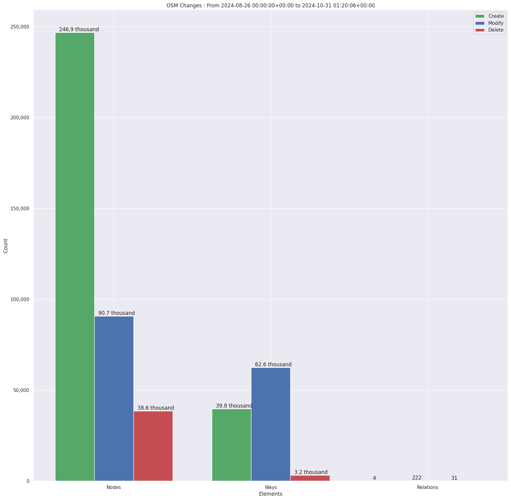

### Last Update : Stats from 2024-08-26 00:00:00+00:00 to 2024-10-07 01:20:31+00:00 (UTC Timezone)

#### 86 Users made 13.4 thousand changesets with 431.9 thousand map changes.
#### 274.1 thousand OSM Elements were Created, 123.1 thousand Modified & 34.7 thousand Deleted.
Get Full Stats at [stats.csv](/stats/watersurfacemapping/Daily/stats.csv)
 & Get Summary Stats at [stats_summary.csv](/stats/watersurfacemapping/Daily/stats_summary.csv)

Top 5 Users are : 
- KingVik : 62.6 thousand Map Changes
- Peter Agenga : 43.5 thousand Map Changes
- Samwel Kyando : 29.3 thousand Map Changes
- charles chilufya : 23.5 thousand Map Changes
- severino chundu : 23.1 thousand Map Changes

Summary of Supplied Tags
- poi = Created: 548, Modified : 3.7 thousand
- building = Created: 427, Modified : 50
- waterway = Created: 6, Modified : 51
- amenity = Created: 0, Modified : 0
- natural = Created: 37.8 thousand, Modified : 50.1 thousand
- water = Created: 37.6 thousand, Modified : 49.7 thousand

Top 5 Created tags are :
- natural: 37.8 thousand
- water: 37.6 thousand
- description: 34.4 thousand
- shape: 34.2 thousand
- category: 2.5 thousand

Top 5 Modified tags are :
- natural: 50.1 thousand
- description: 49.9 thousand
- water: 49.7 thousand
- shape: 48.4 thousand
- category: 31.0 thousand

Top 5 trending hashtags are:
- #fao_swalim : 86 users
- #LA : 86 users
- #watersurfacemapping2024 : 86 users
- #omhesa : 86 users
- #hotosm-project-17522 : 38 users

Top 5 trending editors are:
- JOSM/1.5 (19160 en) : 30 users
- iD 2.21.1 : 17 users
- JOSM/1.5 (18822 en) : 11 users
- JOSM/1.5 (19207 en) : 9 users
- JOSM/1.5 (19128 en) : 6 users

Top 5 trending Countries where user contributed are:
- Somalia : 85 users
- Ethiopia : 29 users
- Kenya : 4 users
- Nigeria : 1 users
- Chad : 1 users

 Charts : 
 
 
 
 
 
